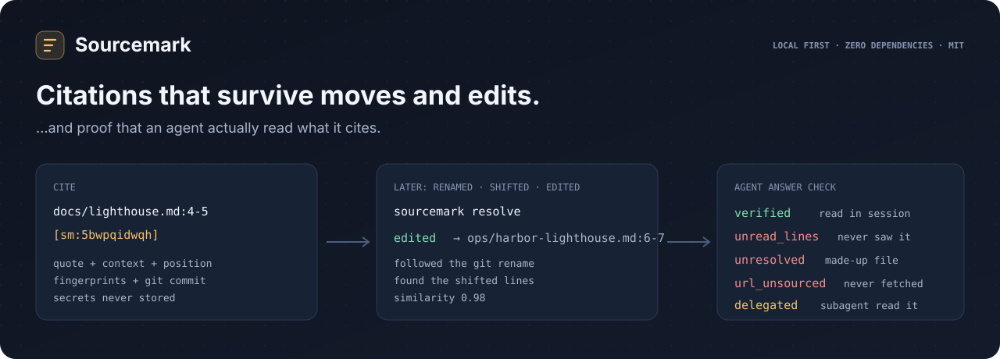

# Sourcemark



**Citations that survive moves and edits — and proof that an agent actually read what it cites.**

Sourcemark anchors a citation to a quote, a file line, or a database value, then re-resolves it later: after the file was renamed, the lines shifted, the text was edited, or the row changed. It also checks an AI agent's answer against what that agent actually read and wrote during the session, so a citation to a file it never opened, a line it never saw, code that is not there, or a link it never fetched is caught before the answer reaches you.

Python 3.11+ · Zero runtime dependencies · MIT · Local only · Early release


## Install

```console
python3 -m venv .venv && . .venv/bin/activate
python3 -m pip install 'git+https://github.com/jonah-ux/sourcemark.git@v0.3.1'
sourcemark --version
python3 demos/demo.py        # 30-second synthetic walkthrough (from a checkout)
```

Each [release](https://github.com/jonah-ux/sourcemark/releases) also ships a wheel, an sdist and
`SHA256SUMS`; `pip install sourcemark-0.3.1-py3-none-any.whl` after checking the hash. Python 3.11+,
no dependencies.

## Usage

```console
sourcemark mark src/app.py:40-42              # → [sm:7f3a9c2b1d]
sourcemark resolve [sm:7f3a9c2b1d]            # intact | shifted | moved | edited | orphaned
sourcemark mark-row public.orders 1042 status total --dsn "$DATABASE_URL"
sourcemark resolve [sm:…] --dsn "$DATABASE_URL"   # intact | drifted (changed: total) | deleted
sourcemark check ~/.claude/projects/<project>/<session>.jsonl
sourcemark verify-ledger
```

## What it answers

**"Where did this come from, and is it still true?"**

| Status | Meaning |
|---|---|
| `intact` | Found exactly where it was cited |
| `shifted` | Same file, different line |
| `moved` | Found in a different file (git rename, or a copy elsewhere under the search roots) |
| `edited` | A close match where it was; the text changed (similarity reported) |
| `orphaned` | Not found anywhere it looked |
| `drifted` / `deleted` | A cited database value changed / its row is gone |

**"Did the agent actually read what it cites?"**

| Verdict | Meaning |
|---|---|
| `verified` | Every cited line was read (or written) in this session |
| `partial` / `unread_lines` | Some / none of the cited lines were read |
| `out_of_range` | The cited line is past the end of the file |
| `unread_file` / `nonexistent` / `unresolved` | The file was never opened / does not exist / cannot be placed |
| `quote_mismatch` | The quoted code is not in the cited lines as read |
| `url_verified` / `url_unsourced` | The link appeared in a tool result or user message / it never did |
| `delegated` | Only a subagent read it; the orchestrator relayed it |

## Agent hook (Claude Code)

One hook is enough: the runtime passes the transcript path, which already records every read and write.

```json
{"hooks": {"Stop": [{"hooks": [{"type": "command", "command": "sourcemark hook stop"}]}]}}
```

`SOURCEMARK_MODE`: `shadow` (default, record only) · `warn` (one-line summary) · `enforce` (send unsupported citations back to the agent to fix; never loops) · `off`. See [docs/hooks.md](docs/hooks.md).

## Codex

`sourcemark check` reads Codex rollouts too (`~/.codex/sessions/YYYY/MM/DD/rollout-*.jsonl`); the format is detected automatically.

```bash
sourcemark check ~/.codex/sessions/2026/10/02/rollout-…jsonl --json
```

Codex runs its tools from small JavaScript cells, so the printed output is whatever the cell printed. sourcemark reads it conservatively:

- A cell that runs one literal `exec_command` and prints its output unchanged is read like a shell command.
- In cells that run several commands, only lines that name their own source count: `path:N:text` hits of a multi-file grep in the cell. So do `nl -ba` / `cat -n` lines under a label that appears exactly once.
- When Codex cut an output (`…N tokens truncated…`), only lines that carry their own line numbers are kept.
- A failed command and a computed command (`cmd: base + x`) give file-level evidence only.
- Links in tool output are sourced, minus links the cell itself typed. Links reported by subagents are `delegated`.

## How it works

A citation stores several independent ways to find the text again — the exact quote with 32 characters of context on each side, its position, fingerprints of the quote and the document, and the git repository, commit and path. Resolving tries the cheapest trustworthy evidence first (the original position, then git renames, then a search of the configured roots) and only accepts a fuzzy match when it is very similar or when **both** sides of its surrounding context agree. Secret-shaped text is never stored, only its fingerprint. Details in [docs/how-it-works.md](docs/how-it-works.md).

## Measured, not assumed

Evaluated against real source files, real git history and real agent sessions. Synthetic fixtures ship in `tests/`.

- **Anchors through real git history:** 4,691 marks replayed through real commits of four repositories (edits, insertions, renames, deletions), checked against a line alignment of the two versions. **99.5%** correct on status and line; 100% of lines that did not change are found. Median **0.6 ms** per resolve.
- **Anchors under synthetic mutation:** about 1,550 cases per seed on 30 real files (insertions, deletions, in-place edits, reindents, git renames, untracked moves, cut/paste, decoy duplicates). **97.3%** (seed 1) and **97.4%** (held-out seed 2).
- **Citation checks on Claude Code sessions:** about 2,900 sessions, with near-miss citations injected next to real evidence (a neighbouring unread line, a range running one line past what was read, a changed word in a quote, an unread file with the same name, a mutated URL). **0.00%** of good citations flagged and **99.9%** of the bad ones caught.
- **Citation checks on Codex rollouts:** about 3,000 rollouts, 47,000 real citations and 8,300 injected near-misses. **0.00%** of good citations flagged, every near-miss kind caught, median **26 ms** per session.
- **Database values:** 40 citations across 4 live production tables, re-resolved against an independent raw read: **100%** agreement.
- **Adversarial review:** three independent reviewers attacked the checker, the resolver, redaction and the ledger. Every reproduced finding is now a regression test, as is every failure found by the benchmarks.

## Agent usage

Agents should call `sourcemark check <transcript> --json` (exit 1 when any citation is unsupported) or install the Stop hook. Every command prints one JSON document with `--json`; exit codes are 0 ok, 1 failed check, 2 usage error. See [AGENTS.md](AGENTS.md).

## Docs

[CLI](docs/cli.md) · [Hooks](docs/hooks.md) · [How it works](docs/how-it-works.md) · [Releasing](docs/releasing.md) · [Changelog](CHANGELOG.md) · [Security](SECURITY.md)

## License

MIT
